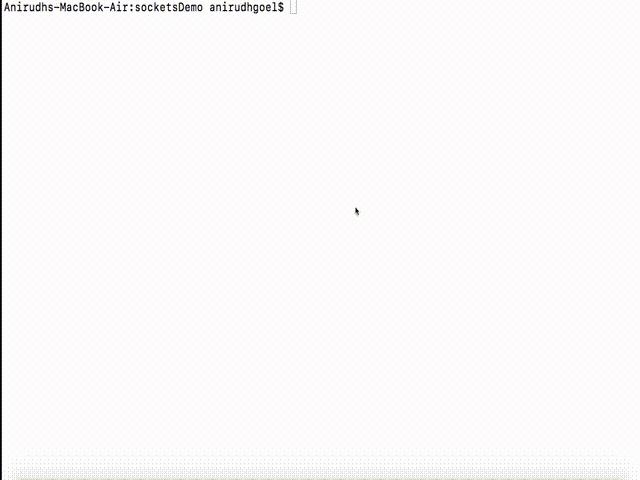

# Sockets Demo
Simple app to demo a websocket connection.

### Server Files
**main.js** - Primary Node.js server to serve the HTML pages and other static files


**server.js** - Websocket server (to receive data from one client and broadcast it to others)

### Installation
```bash
git clone https://github.com/AnirudhGoel/socketsDemo && cd socketsDemo
npm install
npm start
```

Open `http://localhost:8080/form` and `http://localhost:8080/display` in separate browser tabs and the data submitted in the _Form Page_ automatically gets updated on the _Display Page_.

### Demo
